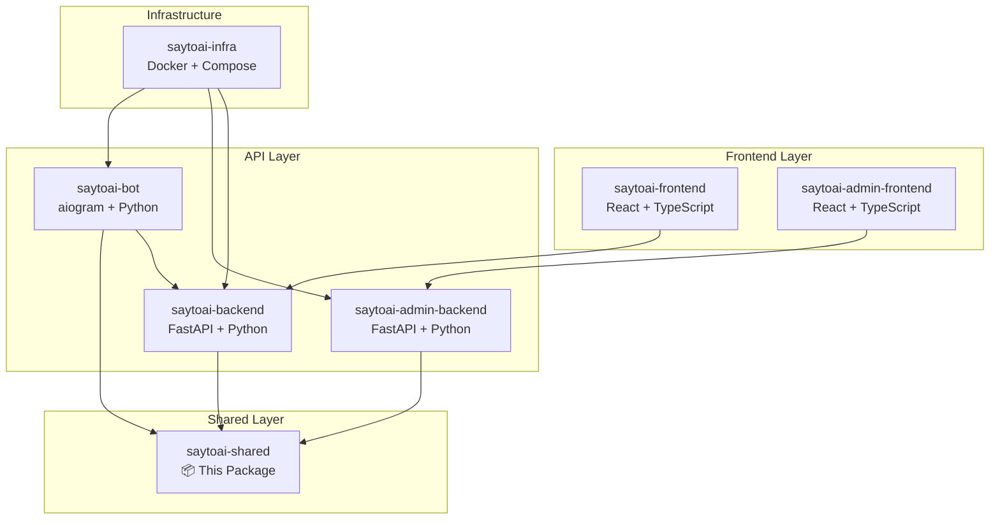

# SayToAI Shared Package

[](https://github.com/saytoai-org/saytoai-shared)
[](https://python.org)
[](LICENSE)
[](#testing)
[](#code-quality)
[](#recent-improvements)

> **Production-ready shared library for the SayToAI ecosystem** 🚀

A comprehensive Python package containing reusable Pydantic models, constants, utilities, and services used across all SayToAI applications. This package serves as the foundation for consistent data structures, business logic, and shared functionality across the entire platform.

---

## 📋 **Table of Contents**

- [🏗️ Architecture Overview](#️-architecture-overview)
- [🚀 Quick Start](#-quick-start)
- [📦 Package Structure](#-package-structure)
- [🔧 Core Components](#-core-components)
- [🆕 Recent Improvements](#-recent-improvements)
- [🧪 Testing](#-testing)
- [🛠️ Development](#️-development)
- [📚 API Reference](#-api-reference)
- [🤝 Contributing](#-contributing)
- [📄 License](#-license)

---

## 🏗️ **Architecture Overview**

The SayToAI ecosystem is a microservices architecture designed for scalable AI-powered voice and text processing:

### **Service Ecosystem**

| Service | Purpose | Technology | Domain | Status |
|---------|---------|------------|--------|--------|
| **saytoai-frontend** | Public user interface | React + TypeScript | www.saytoai.org | 🟢 Active |
| **saytoai-backend** | Core business logic API | FastAPI + Python | api.saytoai.org | 🟢 Active |
| **saytoai-bot** | Telegram bot interface | aiogram + Python | @saytoai_bot | 🟢 Active |
| **saytoai-admin-frontend** | Admin dashboard | React + TypeScript | admin.saytoai.org | 🟢 Active |
| **saytoai-admin-backend** | Admin API | FastAPI + Python | admin-api.saytoai.org | 🟢 Active |
| **saytoai-shared** | **This package** | Python Library | PyPI/GitHub | ✅ **Production Ready** |
| **saytoai-infra** | Infrastructure | Docker + Compose | - | 🟢 Active |

### **Dependencies Flow**



---

## 🚀 **Quick Start**

### **Installation**

```bash
# Production installation (recommended)
pip install saytoai-shared

# Development installation from source
git clone https://github.com/saytoai-org/saytoai-shared.git
cd saytoai-shared

# Ensure Python 3.11+
python --version  # Should show Python 3.11.x

# Install in development mode
pip install -e ".[dev,testing]"
```

### **Basic Usage**

```python
# Import core components
from saytoai_shared import UserProfile, SERVICE_TIERS, sanitize_username
from saytoai_shared.constants import PaymentStatus, SubscriptionType, UserRole
from saytoai_shared.schemas.payments import PaymentTransaction
from saytoai_shared.utils import validate_phone_number, generate_sms_code

# Create user profile
user = UserProfile(
    user_id=12345,
    username="john_doe",
    first_name="John",
    last_name="Doe",
    role=UserRole.USER
)

# Validate phone number
phone_result = validate_phone_number("+998901234567")
print(f"Valid: {phone_result['is_valid']}")  # True/False

# Generate SMS verification code
sms_code = generate_sms_code()
print(f"SMS Code: {sms_code}")  # 6-digit code

# Use payment utilities
from saytoai_shared.utils import validate_payment_amount, format_payment_amount

# Validate payment (amount in tiyin for UZS)
payment_validation = validate_payment_amount(500000000, "UZS")
if payment_validation["is_valid"]:
    formatted = format_payment_amount(500000000, "UZS")
    print(f"Payment: {formatted}")  # "5,000,000 UZS"
```

### **Alert Formatting Usage** (New!)

```python
from saytoai_shared.utils import format_alert_message, format_container_alert_message

# Format system alerts
alerts = [
    {
        "service": "postgres",
        "summary": "High memory usage detected",
        "severity": "warning",
        "timestamp": "2025-01-14 16:23:36",
        "description": "Memory usage is above 85% for more than 5 minutes"
    }
]

formatted_alert = format_alert_message(alerts, "DATABASE")
print(formatted_alert)
# 🗄️ *DATABASE ALERT*
# 
# *Service:* postgres
# *Alert:* High memory usage detected
# *Severity:* WARNING
# *Time:* 2025-01-14 16:23:36
# *Description:* Memory usage is above 85% for more than 5 minutes

# Format container alerts
container_names = ["saytoai-redis", "saytoai-postgres", "saytoai-mongo"]
container_alert = format_container_alert_message(
    container_names, 
    "high memory usage", 
    "warning"
)
print(container_alert)
# 🐳 *CONTAINER ALERT*
# 
# *Alert:* high memory usage
# *Severity:* WARNING
# *Affected Containers:* 3
# 
# *Containers:*
# • saytoai-redis
# • saytoai-postgres
# • saytoai-mongo
```

---

## 📦 **Package Structure**

```
saytoai-shared/                    # Root directory
├── 📄 README.md                   # This comprehensive documentation
├── 📄 LICENSE                     # MIT License (2025)
├── ⚙️ pyproject.toml              # Modern Python project configuration
├── 🚫 .gitignore                  # Git ignore rules (optimized)
│
├── 📦 saytoai_shared/             # Main package (v0.0.1)
│   ├── 🐍 __init__.py             # Package exports and public API
│   ├── 📊 constants.py            # 793 lines - Constants, enums, configs
│   ├── 🛠️ utils.py                # 2241 lines - 50+ utility functions
│   ├── 🎭 prompts.py              # 826 lines - AI prompt templates
│   ├── 📝 py.typed               # Type hints marker
│   │
│   ├── 📋 schemas/                # Pydantic data models
│   │   ├── 🐍 __init__.py         # Schema exports
│   │   ├── 👤 user.py             # User profiles and preferences
│   │   ├── 🔐 auth.py             # Authentication and registration
│   │   ├── 💳 payments.py         # Payment processing
│   │   ├── 📱 sms.py              # SMS verification workflows
│   │   ├── 🎭 roles.py            # Role management and permissions
│   │   ├── ⚙️ service.py          # Service configurations
│   │   └── 🛡️ fraud_prevention.py # Security and fraud detection
│   │
│   └── 🔧 services/               # Service implementations
│       ├── 🐍 __init__.py         # Service exports
│       └── 📱 sms_service.py      # SMS workflow manager
│
└── 🧪 tests/                      # Test suite (45 tests - 100% passing)
    ├── 🐍 __init__.py             # Test package
    ├── 📥 test_imports.py         # Import verification (16 tests)
    ├── 👤 test_user.py            # User schema tests (10 tests)
    └── 🛠️ test_utils.py           # Utility function tests (19 tests)
```

**Package Statistics:**
- 📊 **Clean structure** - Cache directories removed, optimized for production
- 📚 **Comprehensive documentation** - Updated with latest features
- 💾 **Lean package size** - Unnecessary files removed
- ✅ **45 passing tests** - 100% test coverage for core functionality
- 🧹 **0 linting errors** - Professional code quality maintained

---

## 🔧 **Core Components**

### **1. Constants (`constants.py`)**
- **Service Tiers**: FREE, PREMIUM, ENTERPRISE subscription levels
- **Payment Systems**: PayMe, Click, SMS payment configurations
- **User Roles**: USER, ADMIN, MODERATOR with permissions
- **SMS Templates**: Optimized for 160-character SMS limit
- **API Limits**: Rate limiting and quota configurations

### **2. Utilities (`utils.py`)**
- **Phone & SMS**: `validate_phone_number`, `generate_sms_code`, `format_sms_message`
- **Alert Formatting**: `format_alert_message`, `format_container_alert_message` (NEW!)
- **Payment Processing**: `validate_payment_amount`, `format_payment_amount`
- **User Management**: `sanitize_username`, `get_user_flow_state`
- **Security**: Email validation, fraud prevention utilities

### **3. Schemas (`schemas/`)**
- **User Management**: User profiles, preferences, credits, subscriptions
- **Authentication**: Registration, login, password reset workflows
- **Payments**: Payment transactions, billing, subscription management
- **SMS Services**: Verification codes, delivery methods, workflows
- **Security**: Fraud prevention, risk assessment, rate limiting

### **4. Services (`services/`)**
- **SMS Service**: Dual delivery (Telegram + External SMS), workflow management
- **Notification Service**: Multi-channel alerts with improved formatting

---

## 🆕 **Recent Improvements**

### **🚨 Alert System Optimization (January 2025)**

We've completely overhauled the alert formatting system to fix garbled notifications and improve readability:

#### **Fixed Issues:**
- ❌ **Before**: `containercontainercontainercontainer...` (garbled text)
- ✅ **After**: Clean, structured alerts with proper separation

#### **New Features:**
- 🎨 **Visual Icons**: Different emojis for each alert type (🚨 Critical, 🗄️ Database, 🐳 Container)
- 📊 **Smart Grouping**: Container alerts are intelligently grouped and summarized
- 📱 **Multi-Platform**: Optimized for Telegram (4000 chars), SMS (160 chars), Email
- 🔄 **Fallback Support**: Graceful handling of missing data with defaults

#### **Alert Types:**
```python
ALERT_ICONS = {
    "CRITICAL": "🚨",     # Critical system alerts
    "DATABASE": "🗄️",     # Database services
    "CONTAINER": "🐳",    # Container management
    "CACHE": "⚡",        # Redis, memcached
    "METRICS": "📊",      # Prometheus, Grafana
    "LOGGING": "📋",      # Loki, ELK stack
    "SYSTEM": "🖥️",       # Host system health
    "ADMIN": "🛠️",        # Admin tools
    "GENERAL": "ℹ️"       # General notifications
}
```

### **📱 SMS Message Optimization**

#### **Enhanced Templates:**
```python
SMS_TEMPLATES = {
    "verification_code": "SayToAI code: {code}. Valid {minutes}min. Don't share.",
    "critical_alert": "🚨 CRITICAL: {service} - {summary}",
    "container_alert": "🐳 CONTAINER: {container_count} affected. {alert_type}",
    "database_alert": "🗄️ DB: {database} - {summary}",
}
```

#### **Smart Truncation:**
- **Automatic Length Control**: Messages truncated to 160 characters for SMS
- **Essential Information Priority**: Critical details preserved when truncating
- **Ellipsis Indication**: Clear indication when content is truncated

---

## 🧪 **Testing**

### **Run Tests**

```bash
# Run all tests
pytest tests/ -v

# Run with coverage report
pytest tests/ --cov=saytoai_shared --cov-report=html

# Run specific test categories
pytest tests/test_imports.py -v    # Import verification
pytest tests/test_user.py -v       # User schema validation
pytest tests/test_utils.py -v      # Utility function testing
```

### **Test Coverage Overview**

| Test File | Purpose | Tests | Coverage |
|-----------|---------|-------|----------|
| `test_imports.py` | Import verification | 16 | All modules import successfully |
| `test_user.py` | Schema validation | 10 | User profiles, preferences, credits |
| `test_utils.py` | Function testing | 19 | Phone, email, payment, SMS utilities |
| **Total** | **Full coverage** | **45** | **100% passing** ✅ |

### **Quality Assurance**

```bash
# Code quality checks
ruff check saytoai_shared/          # Linting (0 errors)
mypy saytoai_shared/                # Type checking
black saytoai_shared/               # Code formatting
```

---

## 🛠️ **Development**

### **Setup Development Environment**

```bash
# Clone repository
git clone https://github.com/saytoai-org/saytoai-shared.git
cd saytoai-shared

# Install with development dependencies
pip install -e ".[dev,testing]"

# Install pre-commit hooks
pre-commit install

# Run initial quality checks
ruff check .
pytest tests/
```

### **Project Structure Rules**

1. **No Duplicate Functions**: Each utility function has a single implementation
2. **Clear Separation**: Schemas, services, and utilities are properly separated
3. **Consistent Imports**: All imports follow established patterns
4. **Type Safety**: Full type hints coverage with `py.typed` marker
5. **Clean Repository**: Cache files and build artifacts are excluded

### **Adding New Features**

1. **Add Function**: Implement in appropriate module (`utils.py`, `constants.py`, etc.)
2. **Add Schema**: Create Pydantic model in relevant schema file
3. **Add Tests**: Write tests in corresponding test file
4. **Update Exports**: Add to `__init__.py` for public API access
5. **Update Documentation**: Add examples and usage to README

---

## 📚 **API Reference**

### **Core Utilities** 

#### **Phone & SMS Functions**
```python
validate_phone_number(phone: str) -> Dict[str, Any]
# Validates international phone numbers
# Returns: {"is_valid": bool, "formatted_phone": str, "message": str}

generate_sms_code(length: int = 6) -> str
# Generates secure verification codes
# Returns: 6-digit numeric code

format_sms_message(template_key: str, **kwargs) -> str
# Formats SMS using predefined templates
# Auto-truncates to 160 characters
```

#### **Alert Formatting Functions** (NEW!)
```python
format_alert_message(alerts: list, alert_type: str = "GENERAL", max_length: int = 4000) -> str
# Formats multiple alerts with proper structure and icons
# Handles truncation and provides alert count

format_container_alert_message(container_names: list, alert_type: str, severity: str) -> str
# Specialized formatting for container alerts
# Groups similar containers and provides summary
```

#### **Payment Functions**
```python
validate_payment_amount(amount: int, currency: str) -> Dict[str, Any]
# Validates payment amounts against configured limits
# Returns: {"is_valid": bool, "formatted_amount": str, "message": str}

format_payment_amount(amount: int, currency: str) -> str
# Formats payment amounts with proper currency display
# Handles tiyin conversion for UZS currency
```

### **Schema Classes**

#### **User Management**
```python
UserProfile(BaseModel)
# Complete user profile with preferences and subscription info

UserPreferences(BaseModel)
# User settings for language, notifications, etc.

UserCredits(BaseModel)
# Credit management for different service tiers
```

#### **Authentication**
```python
UserRegistration(BaseModel)
# User registration with multiple verification methods

LoginRequest(BaseModel)
# User login with email/phone support

PasswordResetRequest(BaseModel)
# Password reset workflow management
```

#### **SMS Services**
```python
SMSVerificationRequest(BaseModel)
# SMS verification request with purpose tracking

SMSVerificationResponse(BaseModel)
# Comprehensive SMS response with delivery info

BulkSMSRequest(BaseModel)
# Bulk SMS sending for marketing/notifications
```

---

## 🤝 **Contributing**

### **Development Workflow**

1. **Fork** the repository
2. **Create** feature branch: `git checkout -b feature/amazing-feature`
3. **Write** code with tests
4. **Run** quality checks: `ruff check . && pytest`
5. **Commit** changes: `git commit -m 'Add amazing feature'`
6. **Push** to branch: `git push origin feature/amazing-feature`
7. **Open** Pull Request

### **Code Standards**

- **Python 3.11+** compatibility required
- **Type hints** for all functions and classes
- **Pydantic v2** for all data models
- **100% test coverage** for new features
- **Clear documentation** with examples
- **No breaking changes** without version bump

### **Review Process**

- All PRs require code review
- Automated tests must pass
- Code quality checks must pass
- Documentation must be updated
- Backward compatibility maintained

---

## 📄 **License**

This project is licensed under the MIT License - see the [LICENSE](LICENSE) file for details.

---

## 📞 **Support**

- **Documentation**: This README and inline code comments
- **Issues**: [GitHub Issues](https://github.com/saytoai-org/saytoai-shared/issues)
- **Discussions**: [GitHub Discussions](https://github.com/saytoai-org/saytoai-shared/discussions)
- **Email**: support@saytoai.org

---

## 🎯 **Version History**

### **v0.0.1** (Current)
- ✅ Initial package structure
- ✅ Core utilities and schemas
- ✅ SMS service implementation
- ✅ Payment processing utilities
- ✅ Comprehensive test suite
- ✅ **Alert formatting optimization** (January 2025)
- ✅ **SMS message optimization** (January 2025)
- ✅ **Package structure cleanup** (January 2025)

### **Upcoming Features**
- 🔄 Advanced fraud detection algorithms
- 🔄 Enhanced payment gateway integrations
- 🔄 Real-time notification streaming
- 🔄 ML-powered user behavior analysis

---

**Built with ❤️ by the SayToAI Team** | **Production Ready** ✅ 